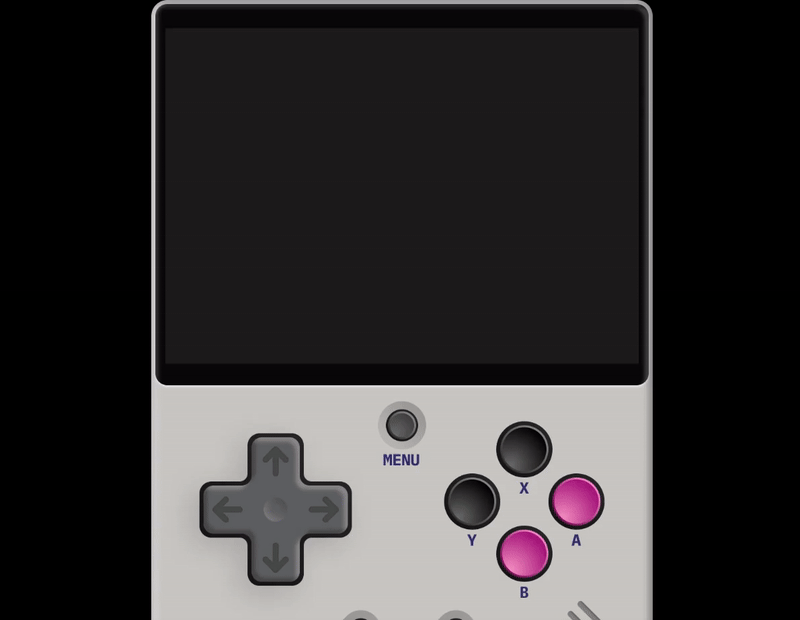

## Arcadia OS

A minimalistic developer platform for linux-based handhelds. Comes with:
  - an app/game launcher application
  - a remote game/app catalog where developers can submit/preview apps and games
  - a React/Swift UI inspired developer SDK
  - a full component library including common components such as buttons, scrollables, tabs, menus and alerts
  - a development server for instantly previewing apps live on supported devices
  - an OTA update system for continuous improvement and support!

## Installing Arcadia
#### R36S Install Guide
TBD

## Developing for Arcadia
TBD

### Currently Supported Devices
- [x] R36S
- [ ] more devices coming soon!

### About

Developer with [LÖVE](love2d.org/) by @wassgha